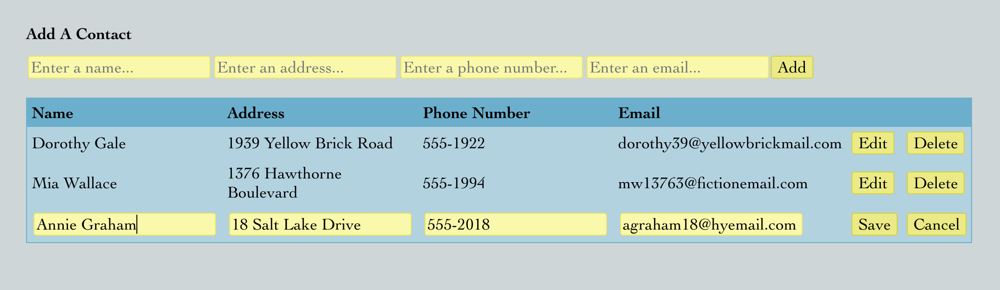

# React Table with Editable Records

## Description

I created a React.js table based on [this](https://www.youtube.com/watch?v=dYjdzpZv5yc) tutorial by [Chris Blakely](https://github.com/chrisblakely01). Contacts are added via a form and can be deleted from the table. Inline edits can also be made to the contact records. Changes can be saved or canceled. Edits are accomplished via conditional rendering of a ReadOnlyRow component and an EditableRow component based on contact id, as well as with useState hooks to prepopulate the EditableRow with the data from the selected ReadOnyRow. 

## Screenshot

## Built with

React.js | JavaScript | JSON | CSS